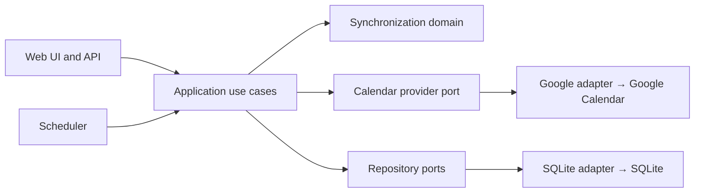

# Google Calendar Sync

A self-hosted, source-authoritative Google Calendar synchronizer. Define a directional rule from
one calendar to another—including calendars owned by different Google identities—and keep a
privacy-controlled projection synchronized without copying invitations or depending on a hosted
coordinator.

> [!WARNING]
> **Pre-alpha:** the architecture, synchronization engine, authenticated API, Google adapter, and
> Web UI form a working first vertical slice, but the project has not completed live-account
> endurance testing or a production-readiness review. Use test calendars and keep backups. Do not
> connect important calendars yet.

## Why this project exists

Sharing availability between personal and work calendars often means granting broad access,
duplicating invitations, or trusting another hosted service. Google Calendar Sync runs on your own
machine and creates only the destination representation selected by each rule.

- **Directional by design:** one rule observes exactly one source calendar and manages exactly one
  destination calendar.
- **Source authoritative:** destination edits, missing projections, and source cancellations are
  repaired during synchronization and reconciliation.
- **Privacy first:** new rules default to a `Busy` projection. Detail-copying remains opt-in and
  never copies attendees, organizer identity, conferencing data, attachments, or invitations.
- **Cross-account:** source and destination calendars may belong to different Google identities.
- **Safe activation:** every rule must pass a side-effect-free preview before it can be enabled.
- **Self-contained:** SQLite, scheduling, the API, and the Web UI run as one lightweight service.
- **No telemetry:** a functional installation communicates only with the Google APIs needed for
  calendar synchronization and any notification endpoint you explicitly configure.

## Current capabilities

| Area | Behavior |
| --- | --- |
| Events | Timed events, all-day events, and cancellations; recurring events are safely excluded for now |
| Policies | Busy-only or detail-copy projection; include or exclude all-day events per rule |
| Scheduling | Source and destination incremental polling every five minutes plus **Sync Now** |
| Reconciliation | Daily full pass plus **Reconcile Now**, with expected-versus-actual drift reporting |
| Loop prevention | Private managed-origin metadata prevents projections from becoming sources |
| Reliability | Stable operation keys, cursor-last persistence, retry backoff, and isolated rule failures |
| Incidents | Authenticated Activity view, deduplication, optional SMTP, and optional webhook delivery |
| Access | One local administrator password and encrypted Google OAuth credentials |
| Deployment | One Docker image and Compose service for `linux/amd64` and `linux/arm64` |

Google Calendar is the only provider in the initial release. Outlook and CalDAV are architectural
possibilities, not currently supported features.

## Quick start with Docker

### Prerequisites

- Docker with Compose
- A Google Cloud project
- One or more Google accounts with Google Calendar enabled

### 1. Configure Google

In Google Cloud:

1. Enable the **Google Calendar API**.
2. Configure the Google Auth Platform consent screen. For an external app in testing, add every
   Google identity you intend to connect as a test user.
3. Create an **OAuth 2.0 Client ID** with application type **Web application**.
4. Add this exact authorized redirect URI:

   ```text
   http://localhost:8000/api/v1/oauth/google/callback
   ```

Google compares OAuth redirect URIs exactly, including scheme, host, port, path, and trailing
slash. See Google's guides for [enabling Workspace APIs](https://developers.google.com/workspace/guides/enable-apis),
[web-server OAuth](https://developers.google.com/identity/protocols/oauth2/web-server), and
[Calendar scopes](https://developers.google.com/workspace/calendar/api/auth).

### 2. Configure local secrets

Copy the example file:

```sh
cp .env.example .env
```

Generate a 256-bit installation master key:

```sh
python3 -c 'import base64,secrets; print(base64.urlsafe_b64encode(secrets.token_bytes(32)).decode())'
```

Then set these values in `.env`:

```dotenv
CALENDAR_SYNC_MASTER_KEY=PASTE_GENERATED_KEY_HERE
CALENDAR_SYNC_GOOGLE_CLIENT_ID=PASTE_GOOGLE_CLIENT_ID_HERE
CALENDAR_SYNC_GOOGLE_CLIENT_SECRET=PASTE_GOOGLE_CLIENT_SECRET_HERE
CALENDAR_SYNC_GOOGLE_REDIRECT_URI=http://localhost:8000/api/v1/oauth/google/callback
```

The master key encrypts stored Google credentials. It is not sent to Google. Back it up separately
from the database and never change it for an existing installation: losing it makes connected
account credentials unreadable.

### 3. Start the service

```sh
docker compose up -d --build
```

Open <http://localhost:8000>, create the local administrator, and follow the three-step setup:

1. Connect each Google identity you need.
2. Create a directional rule and choose its privacy and all-day policies.
3. Preview the rule, inspect the result, and enable it.

Check service health with:

```sh
curl --fail http://localhost:8000/health
```

Stop the installation without deleting its named data volume:

```sh
docker compose down
```

## How synchronization works

The first run reads source events ending no earlier than 30 days before the run, with no future
cutoff, observes the destination calendar, and records Google's opaque incremental tokens for both
endpoints. Later runs consume both change feeds, so a destination-only edit or deletion is repaired
on the next sync without repeatedly scanning every event.

For every relevant source event, the domain chooses one action:

- **Create** a projection when none is mapped or the managed destination is missing.
- **Update** when source data or destination drift differs from the expected projection.
- **Delete** only when a mapping proves ownership and the source was cancelled or excluded.
- **Ignore** content that is current, excluded, or itself a managed projection.
- **Conflict** when identity or ownership is ambiguous; the system does not guess.

The cursor advances only after every change in the batch succeeds. Provider writes carry stable
operation keys so a retry after partial failure recovers the same logical projection instead of
creating a duplicate. See [the synchronization model](docs/sync-model.md) for the complete behavior.

## Privacy and security model

- Event titles, descriptions, and locations are processed in memory and are not stored in SQLite
  or audit entries.
- Mappings retain provider IDs, revisions, and a non-reversible projection fingerprint.
- Google access and refresh credentials are encrypted at rest with AES-256-GCM using the separate
  installation master key.
- The OAuth flow requests event access and read-only calendar-list discovery; it does not request
  general Google account access.
- Google writes use `sendUpdates=none`, and projections contain no attendees or invitation data.
- The Web UI and operational API require the local administrator session. `/health` remains public
  and intentionally minimal.
- There is no mandatory analytics, license server, remote logging, or developer-operated backend.

For deployment hardening, backup expectations, and HTTPS guidance, read
[docs/deployment.md](docs/deployment.md). Report vulnerabilities privately as described in
[SECURITY.md](SECURITY.md).

## Configuration reference

Docker Compose reads `.env` from the repository root. Real secrets must never be committed.

| Variable | Required | Purpose |
| --- | --- | --- |
| `CALENDAR_SYNC_DATABASE_PATH` | No | SQLite path; defaults locally to `./calendar-sync.db`, while Compose uses `/data/calendar-sync.db` |
| `CALENDAR_SYNC_MASTER_KEY` | For Google | URL-safe Base64 value decoding to exactly 32 bytes |
| `CALENDAR_SYNC_GOOGLE_CLIENT_ID` | For Google | OAuth Web application client ID |
| `CALENDAR_SYNC_GOOGLE_CLIENT_SECRET` | For Google | OAuth Web application client secret |
| `CALENDAR_SYNC_GOOGLE_REDIRECT_URI` | For Google | Exact registered OAuth callback |
| `CALENDAR_SYNC_SECURE_COOKIES` | No | Set `true` when serving the app over HTTPS |
| `CALENDAR_SYNC_LOG_LEVEL` | No | Application log level; defaults to `INFO` |
| `CALENDAR_SYNC_INCIDENT_WEBHOOK_URL` | No | Receives a JSON POST when a deduplicated incident opens |
| `CALENDAR_SYNC_SMTP_HOST` | No | SMTP server for incident email |
| `CALENDAR_SYNC_SMTP_PORT` | No | SMTP port; defaults to `587` |
| `CALENDAR_SYNC_SMTP_USERNAME` | No | Optional SMTP authentication username |
| `CALENDAR_SYNC_SMTP_PASSWORD` | No | Optional SMTP authentication password |
| `CALENDAR_SYNC_SMTP_SENDER` | With SMTP | Incident email sender |
| `CALENDAR_SYNC_SMTP_RECIPIENT` | With SMTP | Incident email recipient |
| `CALENDAR_SYNC_SMTP_STARTTLS` | No | Enable SMTP STARTTLS; defaults to `true` |

Notification delivery is best-effort. A delivery failure never prevents the incident from being
recorded locally or stops later synchronization attempts.

## Architecture

The project is a modular monolith with ports-and-adapters boundaries. The synchronization domain
contains no FastAPI, SQLite, Google SDK, React, OAuth, or Docker dependencies.



Runtime frameworks and providers are replaceable edges around the product's core decisions. Read
[docs/architecture.md](docs/architecture.md), [docs/domain-model.md](docs/domain-model.md), and the
[architecture decision records](docs/adr/) before making structural changes. Canonical domain
language and settled product decisions live in [CONTEXT.md](CONTEXT.md).

## Local development

Backend requirements: Python 3.12. Frontend requirements: Node.js 22 or later.

```sh
python3.12 -m venv .venv
.venv/bin/pip install -e '.[dev]'
npm ci --prefix web
```

Run FastAPI on port 8000:

```sh
.venv/bin/uvicorn calendar_sync.interfaces.api.app:create_app --factory --reload
```

In another terminal, run Vite on port 5173:

```sh
npm --prefix web run dev
```

Vite proxies `/api` and `/health` to FastAPI. The OpenAPI interface is available at
<http://localhost:8000/api/docs>.

### Quality checks

```sh
.venv/bin/ruff format --check .
.venv/bin/ruff check .
.venv/bin/mypy
.venv/bin/pytest --cov --cov-report=term-missing --cov-fail-under=80
npm --prefix web run typecheck
npm --prefix web run lint
npm --prefix web run build
docker compose build
```

The normal test suite uses synthetic fixtures and fake providers; it never requires a personal
Google account. CI runs formatting, linting, strict type checking, tests, frontend compilation, and
multi-platform Docker builds.

See [docs/development.md](docs/development.md) for architecture rules and
[CONTRIBUTING.md](CONTRIBUTING.md) for the contribution workflow.

## Repository map

```text
AGENTS.md          Canonical project instructions for coding agents
src/calendar_sync/
  domain/          Provider-independent entities, value objects, policies, and decisions
  application/     Use cases and boundary protocols
  infrastructure/  Google, SQLite, security, scheduling, and notification adapters
  interfaces/      FastAPI routes and the compiled Web UI
  bootstrap/       Explicit dependency composition
web/               React, TypeScript, Vite, Tailwind CSS, and shadcn-style component source
tests/             Domain, application, adapter, and public-boundary tests
docs/              Architecture, operation guides, domain references, and ADRs
```

## Project status and support

This repository currently targets `0.1.0` and follows semantic versioning. Persistent configuration
and SQLite migrations are treated as compatibility surfaces, but pre-alpha releases may still
change behavior before the first stable release.

- For setup and operational failures, start with [docs/troubleshooting.md](docs/troubleshooting.md).
- For proposed changes, open a focused issue describing the observable problem and expected
  behavior.
- For exploitable security issues, do **not** file a public issue; follow
  [SECURITY.md](SECURITY.md).

## Contributing

Contributions are welcome. Please read [CONTRIBUTING.md](CONTRIBUTING.md) and
[CODE_OF_CONDUCT.md](CODE_OF_CONDUCT.md) before opening a pull request. Changes to synchronization
behavior should include domain tests; hard-to-reverse architectural choices should include an ADR.

## License

Google Calendar Sync is available under the [MIT License](LICENSE).
